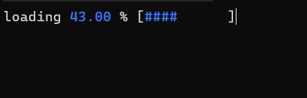
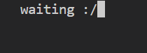
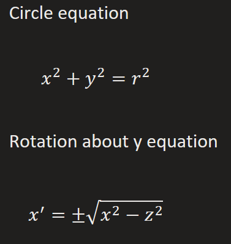
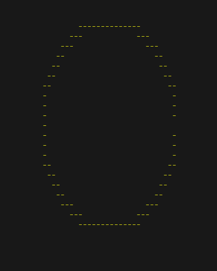

# animation using cli
these projects use mainly [ansi escape sequences](https://gist.github.com/fnky/458719343aabd01cfb17a3a4f7296797) 

## loading bar without GUI 🚀🚀 (python)
This loading bar look like I used GUI but Trust me I didn't

## waiting animation 😩😩 (python)
Another non-gui animation sorry but they are quite fancy 😂

## rotating a cli circle 😲😲 (python)
It was very tiring I hope it interest you 🥱🥱😴😴

to understand how hard it is you should [watch this](https://www.youtube.com/watch?v=sW9npZVpiMI)

This project uses:
- mainly 3D geometry to rotate the circle about y-axis 

- files i/o

