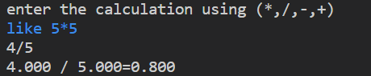
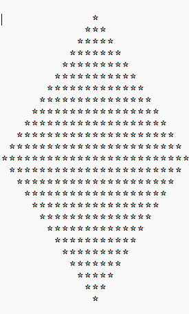
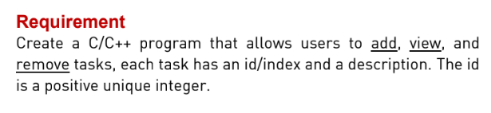
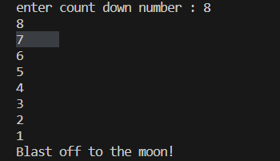

# general projects

## simple calculator using c ✖️➕➖➗
A simple calculator I have no more explanation 😂

## a diamond shape generator (python) 🔷🔶
a diamond shape using while loop 🔁

## Task manager system (c) 🎒🏫🛌🏿
this is a task manager provides functionalities as follow

## counter with delay ⌛⏳⏲️
this project can be used as a timer 

